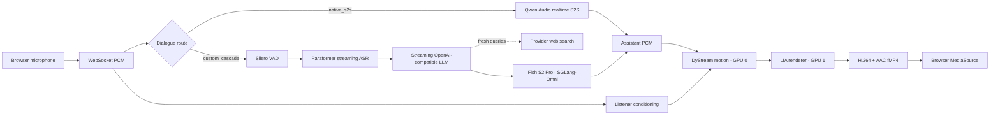

<div align="center">


# FlashAV2AV

**Real-time conversational avatars with customizable portraits and zero-shot voice cloning.**

[](https://github.com/XinchengSun/FlashAV2AV/actions/workflows/ci.yml)
[](https://www.python.org/)
[](#requirements)
[](VERSION)

[中文](README_zh-CN.md) · [Quick Start](#quick-start) · [Architecture](#architecture) · [Benchmarks](#benchmarks) · [Weights](docs/weights.md) · [Customization](README_CUSTOMIZATION.md)

</div>

FlashAV2AV turns a browser microphone stream into a continuously rendered talking avatar. It combines streaming speech understanding, response generation, speech synthesis, DyStream motion, LIA rendering, H.264/AAC fragmented MP4, and browser MediaSource playback on one interruptible timeline.

## Highlights

- **Full-duplex interaction** — microphone input remains live while the avatar is speaking, with barge-in cancellation and graceful media handoff.
- **Continuous Listener and Speaker motion** — both modes share the same recurrent DyStream state instead of restarting the avatar at every turn.
- **Two dialogue routes** — native speech-to-speech for a compact path, or a configurable Paraformer → LLM → cloned-TTS cascade.
- **Real-time information** — the cascade can route fresh-information queries to provider-backed web search without enabling LLM thinking mode.
- **Local customization** — portrait and reference-voice assets stay outside Git and can be selected through a local customization workflow.
- **One lifecycle CLI** — setup, configure, start, status, restart, and stop manage the selected TTS path and AV2AV service with ownership and readiness checks.

## Architecture



Pipecat owns dialogue orchestration, turn events, and cancellation. `server_mse.py` owns the continuous AV2AV state, motion/render workers, A/V boundaries, fragmented MP4 transport, and browser WebSocket session. See [architecture.md](docs/architecture.md) for the state contract.

## Deployment routes

| Route | Speech pipeline | GPU topology | Best for |
| --- | --- | --- | --- |
| `custom_cascade` (current deployment) | Silero → Paraformer → streaming LLM → Fish S2 Pro / SGLang-Omni | 2 DyStream GPUs + 2 separate Fish GPUs | Zero-shot voice cloning, model selection, and real-time search |
| `native_s2s` | Qwen Audio realtime speech-to-speech | 2 non-overlapping DyStream GPUs | Compact compatibility route |
| VoxCPM2 fallback | The same cascade through the compatible local PCM bridge | 2 DyStream GPUs + 1 separate VoxCPM2 GPU | Compatibility and rollback |

Fish Speech S2 Pro is the primary TTS in the current deployment. It runs through SGLang-Omni with the TTS engine and vocoder split across two GPUs; VoxCPM2 remains a compatible fallback.

## Requirements

The checked runtime contract is intentionally strict:

| Component | Checked configuration |
| --- | --- |
| Host | Linux, NVIDIA GPU, `ffmpeg`, `ffprobe`, `curl`, `flock`, `nvidia-smi` |
| Python | 3.11 |
| PyTorch | `2.8.0+cu128` |
| CUDA runtime | 12.8 |
| Avatar output | 512 × 512, H.264 video + AAC audio |
| DyStream | two distinct logical CUDA devices |
| Current custom cascade | two Fish GPUs that do not overlap the two DyStream GPUs |
| VoxCPM2 fallback | one additional GPU that does not overlap DyStream |

The release installer has been validated for structure and dependency checks, but a blank-host multi-GPU installation is not exercised by GitHub CI.

## Quick Start

### 1. Clone and install

```bash
git clone https://github.com/XinchengSun/FlashAV2AV.git
cd FlashAV2AV

# Keep multi-gigabyte models, environments, and caches outside Git.
export FLASHAV2AV_DATA_ROOT=/data/flashav2av
bash scripts/flashav2av setup
```

The unified `setup` command prepares Pipecat and Paraformer, downloads the required Fish S2 Pro and DyStream/LIA/Wav2Vec2 assets, and creates ignored runtime symlinks. Fish still requires the checked SGLang-Omni source and Python environment on the host; the installer does not bootstrap that GPU runtime from a blank machine.

The current installer is **not a universal CUDA bootstrap**: it expects the checked base runtime (`torch 2.8.0+cu128`, CUDA 12.8, MediaPipe, and the DyStream dependencies) to already be available to its `--system-site-packages` environment. Use it on the tested server image, or reproduce that base environment first. A container/lockfile for a blank host is still pending.

### 2A. Native speech-to-speech

Copy `.env.example` to a private `.env`, then set at least:

```dotenv
PIPECAT_MSE_DIALOG_MODE=native_s2s
PIPECAT_S2S_API_KEY=your_private_key
DYSTREAM_REF_IMAGE=/absolute/path/to/authorized-avatar.png

CUDA_VISIBLE_DEVICES=0,1
MOTION_GPU=0
RENDER_GPU=1
```

### 2B. Current Fish S2 Pro custom cascade

The deployed TTS path consists of a two-GPU SGLang-Omni service plus a local PCM bridge. Configure it through the unified lifecycle command; this example reserves GPUs 0/1 for DyStream and GPUs 2/3 for Fish:

```bash
bash scripts/flashav2av configure \
  --source-env /absolute/path/to/private-base.env \
  --prompt-wav /absolute/path/to/authorized-reference.wav \
  --prompt-text-file /absolute/path/to/reference-transcript.txt \
  --dystream-gpus 0,1 \
  --fish-gpus 2,3 \
  --tts-backend fish_s2pro \
  --realtime-search-mode smart \
  --realtime-search-strategy turbo
```

`fish_s2pro` is the default TTS backend. `scripts/flashav2av start` manages the Fish HTTP service on port 8001 and its local PCM bridge on port 8771 together with the AV2AV service. The generic Pipecat adapter still accepts the legacy `VOXCPM2_BRIDGE_URI` variable for compatibility.

### 2C. VoxCPM2 compatibility setup

Prepare a private source env containing a DashScope/OpenAI-compatible key and an authorized reference voice, then generate isolated runtime envs:

```bash
bash scripts/flashav2av setup-voxcpm2

bash scripts/flashav2av configure \
  --source-env /absolute/path/to/private-base.env \
  --prompt-wav /absolute/path/to/authorized-reference.wav \
  --prompt-text-file /absolute/path/to/reference-transcript.txt \
  --dystream-gpus 0,1 \
  --tts-backend voxcpm2 \
  --tts-gpu 2 \
  --realtime-search-mode smart \
  --realtime-search-strategy turbo
```

The generated env files are written with mode `0600` under `$FLASHAV2AV_DATA_ROOT/config/`. LLM thinking is explicitly disabled in this low-latency path.

### 3. Start the managed AV2AV service

```bash
bash scripts/flashav2av start
```

`DEMO_READY` means the workers, selected dialogue route, reachable bridge, and decodable media smoke test passed. The service binds to loopback by default. From a remote machine:

```bash
ssh -N -L 6008:127.0.0.1:7860 <user>@<server>
```

Open <http://127.0.0.1:6008/>, keep one demo tab, click **Start conversation**, and allow microphone access.

Useful lifecycle commands:

```bash
bash scripts/flashav2av status
bash scripts/flashav2av restart
bash scripts/flashav2av stop
bash scripts/flashav2av setup --check-only
```

## Benchmarks

### Fish S2 Pro dual-GPU TTS

Warm single-request measurements on an 8 × RTX 4090 host; the dual-GPU profiles used physical GPUs 5 and 6. Each profile contains 60 measured samples after 3 discarded warm-up samples. These values cover only the TTS bridge—not ASR, LLM, DyStream, encoding, network, or browser playback.

| Profile | First PCM P50 / P95 | Audible TTFA P50 / P95 | RTF P50 / P95 | Starved samples |
| --- | ---: | ---: | ---: | ---: |
| Single GPU, stride 20/10 | 1259 / 1298 ms | 1262 / 1392 ms | 0.592 / 0.612 | 0 / 60 |
| Dual GPU, stride 20/10 | 666 / 692 ms | 672 / 763 ms | 0.561 / 0.584 | 0 / 60 |
| Dual GPU, stride 10/10 | **426 / 436 ms** | **431 / 579 ms** | 0.564 / 0.584 | 0 / 60 |

Raw benchmark record: [`docs/fishspeech_2gpu_benchmark_20260811.json`](docs/fishspeech_2gpu_benchmark_20260811.json).

No reproducible microphone-to-visible-avatar E2E benchmark is published yet. Provider latency, endpointing, browser buffering, and GPU contention must be reported separately; TTS-only figures must not be presented as conversational latency.

## Model weights

Weights are downloaded directly from their official upstream repositories and are never committed to Git:

```bash
python scripts/setup_weights.py download
python scripts/setup_weights.py verify --deep

```

`verify --deep` checks recorded hashes where available. The current public manifest publishes no SHA-256 values, so it verifies file presence and recorded sizes; it does not claim cryptographic integrity. See [weights.md](docs/weights.md) for the inventory, revisions, paths, and license status.

## Avatar and voice customization

After startup, open the local-only customization page:

```text
http://127.0.0.1:6008/customize
```

Portraits, voice recordings, transcripts, generated latents, caches, and rollback snapshots remain private runtime assets. They are ignored by Git. See [README_CUSTOMIZATION.md](README_CUSTOMIZATION.md).

## Runtime verification

A demonstration should pass all of the following:

- motion and render workers are alive;
- the selected dialogue route reports ready;
- media probes decode H.264 and AAC;
- Listener, Speaker, and interruption stay on one continuous timeline;
- at least three consecutive turns complete;
- a barge-in returns to Listener and a new turn can start;
- long-running browser playback does not exhaust its media buffer.

```bash
bash scripts/flashav2av status
tail -f logs/pipecat_mse.log
```

## Repository layout

```text
pipecat_dystream/   dialogue, ASR, LLM, search, TTS, and MSE adapters
voice_service/      Fish/SGLang-compatible and VoxCPM2 fallback PCM bridges
model/              DyStream motion model code
tools/              LIA renderer and preprocessing code
static/             browser demo and customization frontend
scripts/            setup, lifecycle, health checks, probes, and benchmarks
tests/              logic, protocol, cancellation, and media regressions
```

`scripts/flashav2av` is the supported entry point and manages the configured Fish S2 Pro or VoxCPM2 TTS path together with the AV2AV service. Legacy offline scripts require local sample media that is intentionally not distributed.

## Known limitations

- The renderer produces native 512 × 512 frames; enlarging the player cannot add model detail.
- Expression, emotion, nod, and blink controls are not exposed as stable production controls.
- Listener naturalness remains dependent on the source checkpoint and conditioning audio.
- GitHub CI validates the release surface, shell syntax, Python syntax, manifest, and credential/weight exclusions; it does not run GPU inference.

See [known_issues.md](docs/known_issues.md) for the current list.

## Acknowledgements

FlashAV2AV builds on [DyStream](https://github.com/XinchengSun/DyStream), [Pipecat](https://github.com/pipecat-ai/pipecat), [Fish Speech S2 Pro](https://huggingface.co/fishaudio/s2-pro), [SGLang-Omni](https://github.com/sgl-project/sglang-omni), [VoxCPM2](https://huggingface.co/openbmb/VoxCPM2), [FunASR/Paraformer](https://github.com/modelscope/FunASR), and [Wav2Vec2](https://huggingface.co/facebook/wav2vec2-base-960h).
