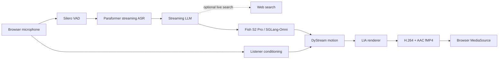

<div align="center">


# FlashAV2AV

**Customizable real-time conversational avatars with zero-shot voice cloning.**

[](https://github.com/XinchengSun/FlashAV2AV/actions/workflows/ci.yml)
[](https://www.python.org/)
[](#tested-setup)

[中文](README_zh-CN.md) · [Quick Start](#quick-start) · [Architecture](#how-it-works) · [Benchmarks](#measured-performance) · [Deployment](docs/deployment.md) · [Customization](README_CUSTOMIZATION.md)

</div>

FlashAV2AV turns one portrait and one short reference recording into a
browser-based conversational avatar. Its primary pipeline streams microphone
audio through Paraformer, an OpenAI-compatible LLM, Fish Speech S2 Pro, and a
continuous DyStream/LIA renderer while preserving one interruptible audio/video
timeline.

> **Current primary stack:** Paraformer + streaming LLM + Fish Speech S2 Pro / SGLang-Omni + DyStream + LIA.

## What it delivers

- **Portrait customization** from a single front-facing image.
- **Zero-shot voice cloning** with Fish Speech S2 Pro from a short reference
  recording and matching transcript.
- **Streaming conversation with barge-in**: microphone capture stays active
  while the avatar speaks, and a new turn can cancel the pending reply.
- **Continuous Listener and Speaker motion** on the same recurrent DyStream
  state instead of restarting the avatar at every turn.
- **Fresh-information queries** through optional provider-backed web search,
  with LLM thinking explicitly disabled on the tested low-latency path.
- **One managed lifecycle** for the Fish service, PCM bridge, AV2AV workers,
  media smoke test, restart, and cleanup.

## Preview

The public repository currently includes the software and a generated
DyStream preview, not a prerecorded end-to-end conversation. The preview shows
the native 512 x 512 avatar output; a reproducible microphone-to-avatar demo
capture is still being prepared.

<div align="center">
  
</div>

## Quick Start

The public installer targets the **tested Linux server image**. It downloads
the model assets and prepares the managed services, but it does not build CUDA
or SGLang-Omni from a blank host. Complete the short Fish runtime prerequisite
in the [deployment guide](docs/deployment.md#prepare-the-fish-runtime) first.

```bash
git clone https://github.com/XinchengSun/FlashAV2AV.git
cd FlashAV2AV

export FLASHAV2AV_DATA_ROOT=/data/flashav2av
bash scripts/flashav2av setup

bash scripts/flashav2av configure \
  --source-env /absolute/path/to/private-base.env \
  --prompt-wav /absolute/path/to/reference.wav \
  --prompt-text-file /absolute/path/to/reference.txt \
  --dystream-gpus 0,1 \
  --fish-gpus 2,3 \
  --tts-backend fish_s2pro \
  --realtime-search-mode smart \
  --realtime-search-strategy turbo

bash scripts/flashav2av start
```

The private base env must provide `PIPECAT_LLM_API_KEY` (or a compatible
DashScope/OpenAI key) and `DYSTREAM_REF_IMAGE`. The two Fish GPUs must not
overlap the two DyStream GPUs. A successful start ends with `DEMO_READY`.

Forward the loopback browser service and open the local URL:

```bash
ssh -N -L 6008:127.0.0.1:7860 <user>@<server>
```

<http://127.0.0.1:6008/>

Full prerequisites, endpoint mapping, native speech-to-speech, and the VoxCPM2
fallback are documented in the [deployment guide](docs/deployment.md).

## How it works



Pipecat owns dialogue orchestration, turn events, and cancellation.
`server_mse.py` owns the continuous avatar state, motion/render workers,
audio/video boundaries, and fragmented-MP4 browser stream. The detailed state
contract and GPU placement are in [architecture.md](docs/architecture.md).

## Tested setup

| Component | Tested configuration |
| --- | --- |
| Host | Linux, Python 3.11, NVIDIA GPUs, `ffmpeg`/`ffprobe` |
| Realtime Python runtime | PyTorch `2.8.0+cu128`, CUDA 12.8 |
| Avatar | two distinct DyStream GPUs; native 512 x 512 output |
| Primary TTS | two additional Fish S2 Pro GPUs, disjoint from DyStream |
| Browser media | H.264 video + AAC audio over fMP4/MSE |

`requirements-pipecat.txt` defines the realtime service dependencies. The root
`requirements.txt` belongs to the legacy/offline research environment and is
not the supported server installer. GitHub CI does not run GPU inference.

## Measured performance

The only published reproducible snapshot is **warm, single-request TTS bridge
latency**; it is not microphone-to-visible-avatar latency. It was measured on
2026-08-11 at commit `29d1bc376fa2` on an 8 x RTX 4090 host. Fish used physical
GPUs 5/6, profile `low_ttfa_gapless` (`stream_stride=10`, follow-up stride 10),
3 warm-up samples were discarded, and 60 requests were measured.

| Metric | Dual-GPU Fish S2 Pro |
| --- | ---: |
| First PCM P50 / P95 | **426 / 436 ms** |
| Audible TTFA P50 / P95 | **431 / 579 ms** |
| RTF P50 / P95 | **0.564 / 0.584** |
| Playback starvation | **0 / 60** |

The full single/dual-GPU comparison is in
[`fishspeech_2gpu_benchmark_20260811.json`](docs/fishspeech_2gpu_benchmark_20260811.json).
ASR, endpointing, LLM, DyStream, encoding, network, and browser buffering are
excluded. No microphone-to-visible-avatar E2E number is published yet.

## Customize the avatar

After startup, open <http://127.0.0.1:6008/customize>. Upload a front-facing
portrait, a clean 10-20 second reference recording, and its matching transcript.
Activation updates the private runtime atomically and rolls back if validation
or restart fails. See [README_CUSTOMIZATION.md](README_CUSTOMIZATION.md).

## Documentation

| Guide | Contents |
| --- | --- |
| [Deployment](docs/deployment.md) | tested host, Fish runtime, ports, lifecycle, alternative backends |
| [Architecture](docs/architecture.md) | Listener/Speaker state, interruption, media boundaries, GPU placement |
| [Customization](README_CUSTOMIZATION.md) | portrait and zero-shot voice-cloning workflow |
| [Model weights](docs/weights.md) | pinned upstream assets and runtime paths |
| [Known issues](docs/known_issues.md) | current visual, expression, and CI boundaries |
| [README study](docs/readme_style_study.md) | the 10-project comparison and rewrite criteria |

## Project status

- Fish S2 Pro is the primary managed TTS; VoxCPM2 and native speech-to-speech
  remain compatibility paths.
- The supported entry point is `bash scripts/flashav2av <command>`.
- Native output is 512 x 512. Enlarging it cannot add model detail.
- A complete fresh-host CUDA/SGLang installer and a reproducible E2E latency
  benchmark are not published yet.

## Acknowledgements

FlashAV2AV builds on [DyStream](https://github.com/XinchengSun/DyStream),
[Pipecat](https://github.com/pipecat-ai/pipecat),
[Fish Speech S2 Pro](https://huggingface.co/fishaudio/s2-pro),
[SGLang-Omni](https://github.com/sgl-project/sglang-omni),
[FunASR/Paraformer](https://github.com/modelscope/FunASR), and
[Wav2Vec2](https://huggingface.co/facebook/wav2vec2-base-960h). VoxCPM2 is
retained as a compatibility backend.
