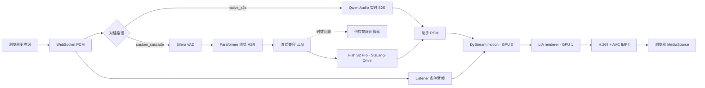

<div align="center">


# FlashAV2AV

**支持头像定制与零样本声音克隆的实时音视频对话数字人。**

[](https://github.com/XinchengSun/FlashAV2AV/actions/workflows/ci.yml)
[](https://www.python.org/)
[](#系统要求)
[](VERSION)

[English](README.md) · [快速开始](#快速开始) · [系统架构](#系统架构) · [性能数据](#性能数据) · [模型权重](docs/weights.md) · [定制说明](README_CUSTOMIZATION.md)

</div>

FlashAV2AV 将浏览器麦克风音频实时转换为连续渲染的对话数字人。系统把流式语音理解、回复生成、语音合成、DyStream motion、LIA 渲染、H.264/AAC fMP4 和浏览器 MSE 播放放在一条可打断的连续时间轴上。

## 核心能力

- **全双工与实时打断**：数字人回复时麦克风仍保持接收；用户插话会取消旧回复并平滑交接媒体。
- **连续 Listener/Speaker 状态**：倾听和说话共用同一个 DyStream recurrent 状态，不在每轮重新初始化人物。
- **两条对话路径**：原生语音到语音，或 Paraformer → LLM → 克隆 TTS 的可配置级联。
- **实时信息查询**：级联路径可把天气、新闻等时效问题路由到供应商搜索，同时保持 LLM 思考模式关闭。
- **本地头像与音色定制**：用户图片、声音、转写和 latent 全部保存在 Git 之外。
- **统一生命周期命令**：安装、配置、启动、检查、重启和停止会管理所选 TTS 链路与 AV2AV 服务，并执行进程所属和 readiness 检查。

## 系统架构



Pipecat 负责对话编排、回合事件和取消；`server_mse.py` 负责连续 AV2AV 状态、motion/render worker、A/V 边界、fMP4 和浏览器 WebSocket。详细状态契约见 [architecture.md](docs/architecture.md)。

## 部署路径

| 路径 | 语音链路 | GPU 拓扑 | 适合场景 |
| --- | --- | --- | --- |
| `custom_cascade`（当前部署） | Silero → Paraformer → 流式 LLM → Fish S2 Pro / SGLang-Omni | 两张 DyStream GPU + 两张独立 Fish GPU | 零样本音色克隆、模型切换和实时搜索 |
| `native_s2s` | Qwen Audio 实时语音到语音 | 两张不重叠的 DyStream GPU | 精简兼容路径 |
| VoxCPM2 回退 | 同一级联通过兼容本地 PCM bridge 输出 | 两张 DyStream GPU + 一张独立 VoxCPM2 GPU | 兼容与回滚 |

当前部署的主 TTS 是 Fish Speech S2 Pro，通过 SGLang-Omni 把 TTS engine 和 vocoder 分配到两张 GPU；VoxCPM2 作为兼容回退。

## 系统要求

当前运行时检查是严格固定的：

| 组件 | 已检查配置 |
| --- | --- |
| 主机 | Linux、NVIDIA GPU、`ffmpeg`、`ffprobe`、`curl`、`flock`、`nvidia-smi` |
| Python | 3.11 |
| PyTorch | `2.8.0+cu128` |
| CUDA runtime | 12.8 |
| 头像输出 | 512 × 512，H.264 视频 + AAC 音频 |
| DyStream | 两个不同逻辑 CUDA 设备 |
| 当前 custom cascade | 两张与 DyStream 两张卡均不重叠的 Fish GPU |
| VoxCPM2 回退 | 一张与 DyStream 不重叠的额外 GPU |

安装结构、依赖检查和 clean clone 已验证；GitHub CI 不运行多 GPU 推理，因此不能把 CI 绿灯理解为新机器 GPU 部署已通过。

## 快速开始

### 1. 克隆与安装

```bash
git clone https://github.com/XinchengSun/FlashAV2AV.git
cd FlashAV2AV

# 大模型、环境和缓存放在 Git 之外。
export FLASHAV2AV_DATA_ROOT=/data/flashav2av
bash scripts/flashav2av setup
```

统一 `setup` 命令会准备 Pipecat 和 Paraformer、下载必需的 Fish S2 Pro 与 DyStream/LIA/Wav2Vec2 资产，并建立 Git 忽略的运行软链接。主机仍需提前具备已检查的 SGLang-Omni 源码和 Python 环境；安装器不会在空白机器上自动构建这套 GPU 运行时。

当前安装器**不是通用 CUDA 引导器**：它要求 `--system-site-packages` 能访问已检查的基础运行时（`torch 2.8.0+cu128`、CUDA 12.8、MediaPipe 和 DyStream 依赖）。请在已验证服务器镜像上运行，或先复现该基础环境。面向空白主机的容器/完整 lockfile 仍待补充。

### 2A. 原生语音到语音

把 `.env.example` 复制为私有 `.env`，至少配置：

```dotenv
PIPECAT_MSE_DIALOG_MODE=native_s2s
PIPECAT_S2S_API_KEY=your_private_key
DYSTREAM_REF_IMAGE=/absolute/path/to/authorized-avatar.png

CUDA_VISIBLE_DEVICES=0,1
MOTION_GPU=0
RENDER_GPU=1
```

### 2B. 当前 Fish S2 Pro 自定义级联

当前 TTS 由双卡 SGLang-Omni 服务和本地 PCM bridge 组成。通过统一生命周期命令配置；下面把 GPU 0/1 分配给 DyStream，把 GPU 2/3 分配给 Fish：

```bash
bash scripts/flashav2av configure \
  --source-env /absolute/path/to/private-base.env \
  --prompt-wav /absolute/path/to/authorized-reference.wav \
  --prompt-text-file /absolute/path/to/reference-transcript.txt \
  --dystream-gpus 0,1 \
  --fish-gpus 2,3 \
  --tts-backend fish_s2pro \
  --realtime-search-mode smart \
  --realtime-search-strategy turbo
```

`fish_s2pro` 是默认 TTS backend。`scripts/flashav2av start` 会同时管理 8001 端口的 Fish HTTP 服务、8771 端口的本地 PCM bridge 和 AV2AV 服务。通用 Pipecat 适配器仍兼容旧变量 `VOXCPM2_BRIDGE_URI`。

### 2C. VoxCPM2 兼容配置

准备包含 DashScope/OpenAI-compatible key 的私有源 env 和已授权参考音频：

```bash
bash scripts/flashav2av setup-voxcpm2

bash scripts/flashav2av configure \
  --source-env /absolute/path/to/private-base.env \
  --prompt-wav /absolute/path/to/authorized-reference.wav \
  --prompt-text-file /absolute/path/to/reference-transcript.txt \
  --dystream-gpus 0,1 \
  --tts-backend voxcpm2 \
  --tts-gpu 2 \
  --realtime-search-mode smart \
  --realtime-search-strategy turbo
```

生成的 env 以 `0600` 权限写入 `$FLASHAV2AV_DATA_ROOT/config/`。低延迟链路会显式关闭 LLM 思考模式。

### 3. 启动受管 AV2AV 服务

```bash
bash scripts/flashav2av start
```

出现 `DEMO_READY` 表示 worker、所选对话路径、可访问的 TTS bridge 和媒体解码 smoke 均通过。服务默认只绑定 loopback；远程访问可使用：

```bash
ssh -N -L 6008:127.0.0.1:7860 <user>@<server>
```

打开 <http://127.0.0.1:6008/>，只保留一个演示标签页，点击“开始对话”并允许麦克风权限。

```bash
bash scripts/flashav2av status
bash scripts/flashav2av restart
bash scripts/flashav2av stop
bash scripts/flashav2av setup --check-only
```

## 性能数据

### Fish S2 Pro 双卡 TTS

以下数据来自 8 × RTX 4090 主机，双卡配置使用物理 GPU 5/6。每个 profile 丢弃 3 个 warm-up 样本后统计 60 个 warm 请求。它只覆盖 TTS bridge，不包含 ASR、LLM、DyStream、编码、网络或浏览器播放。

| 配置 | 首 PCM P50 / P95 | 可听 TTFA P50 / P95 | RTF P50 / P95 | 断流样本 |
| --- | ---: | ---: | ---: | ---: |
| 单卡，stride 20/10 | 1259 / 1298 ms | 1262 / 1392 ms | 0.592 / 0.612 | 0 / 60 |
| 双卡，stride 20/10 | 666 / 692 ms | 672 / 763 ms | 0.561 / 0.584 | 0 / 60 |
| 双卡，stride 10/10 | **426 / 436 ms** | **431 / 579 ms** | 0.564 / 0.584 | 0 / 60 |

原始汇总：[`docs/fishspeech_2gpu_benchmark_20260811.json`](docs/fishspeech_2gpu_benchmark_20260811.json)。

目前尚未发布可复现的“用户停止说话 → 浏览器人脸开始说话”端到端基准。供应商时延、判停、浏览器缓冲和 GPU 争用必须分项报告；不能把 TTS-only 数字冒充对话时延。

## 模型权重

权重直接从官方上游下载，不提交到 Git：

```bash
python scripts/setup_weights.py download
python scripts/setup_weights.py verify --deep

```

`verify --deep` 仅在 manifest 存在可信 hash 时校验 SHA-256。当前公开 manifest 尚未发布 SHA-256，因此只检查文件存在性和记录尺寸，不宣称密码学完整性。完整清单、revision、路径和许可证见 [weights.md](docs/weights.md)。

## 头像与音色定制

启动后打开本地定制入口：

```text
http://127.0.0.1:6008/customize
```

头像、声音、转写、latent、缓存和回滚快照全部属于私有运行资产并被 Git 忽略。详见 [README_CUSTOMIZATION.md](README_CUSTOMIZATION.md)。

## 运行验收

- motion/render worker 都 alive；
- 所选对话路径 ready；
- 媒体探针可解码 H.264 + AAC；
- Listener、Speaker 和打断处于同一连续时间轴；
- 至少连续完成三轮对话；
- 打断后能返回 Listener 并开始下一轮；
- 长时间播放时浏览器缓冲不耗尽。

```bash
bash scripts/flashav2av status
tail -f logs/pipecat_mse.log
```

## 目录结构

```text
pipecat_dystream/   对话、ASR、LLM、搜索、TTS 和 MSE 适配
voice_service/      Fish/SGLang 兼容 bridge 与 VoxCPM2 回退 bridge
model/              DyStream motion 模型代码
tools/              LIA renderer 与预处理代码
static/             浏览器演示与定制前端
scripts/            安装、生命周期、检查、探针与 benchmark
tests/              逻辑、协议、取消和媒体回归
```

`scripts/flashav2av` 是正式入口，会同时管理已配置的 Fish S2 Pro 或 VoxCPM2 TTS 链路与 AV2AV 服务。旧离线脚本依赖没有发布的本地示例媒体，不属于 clean-clone 支持路径。

## 已知限制

- renderer 原生只输出 512 × 512；放大页面不会增加模型细节。
- 表情、情绪、点头和眨眼目前没有作为稳定控制能力开放。
- Listener 自然度仍受 checkpoint 和 conditioning audio 影响。
- GitHub CI 只验证发布表面，不运行 GPU 推理。

详见 [known_issues.md](docs/known_issues.md)。

## 致谢

FlashAV2AV 基于 [DyStream](https://github.com/XinchengSun/DyStream)、[Pipecat](https://github.com/pipecat-ai/pipecat)、[Fish Speech S2 Pro](https://huggingface.co/fishaudio/s2-pro)、[SGLang-Omni](https://github.com/sgl-project/sglang-omni)、[VoxCPM2](https://huggingface.co/openbmb/VoxCPM2)、[FunASR/Paraformer](https://github.com/modelscope/FunASR) 和 [Wav2Vec2](https://huggingface.co/facebook/wav2vec2-base-960h) 构建。
