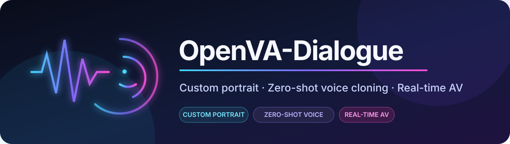
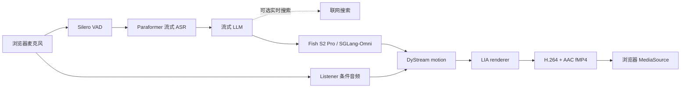

<div align="center">



# OpenVA-Dialogue

**面向全双工实时音视频对话的开源智能体系统。**

[](https://github.com/XinchengSun/OpenVA-Dialogue/actions/workflows/ci.yml)
[](https://www.python.org/)
[](#已测试环境)

[English](README.md) · [快速开始](#快速开始) · [工作原理](#工作原理) · [实测性能](#实测性能) · [部署文档](docs/deployment_zh-CN.md) · [定制说明](README_CUSTOMIZATION.md)

</div>

OpenVA-Dialogue 是面向全双工实时音视频对话的开源智能体系统。使用一张人物正脸图和一段短参考声音，即可生成在浏览器中实时对话的数字人。当前主链路依次使用 Paraformer、兼容 OpenAI API 的 LLM、Fish Speech S2 Pro，以及连续运行的 DyStream/LIA 渲染器，并把对话、声音和人脸放在同一条可打断音视频时间轴上。

**关键词：** 全双工对话、音视频对话、实时交互、流式生成。

项目原名 FlashAV2AV。现有 `scripts/flashav2av` 命令、`FLASHAV2AV_*` 环境变量和引擎版本标识保持兼容。

> **当前主链路：** Paraformer + 流式 LLM + Fish Speech S2 Pro / SGLang-Omni + DyStream + LIA。

## 核心能力

- **形象定制**：使用一张正脸图生成当前数字人形象。
- **零样本音色克隆**：Fish Speech S2 Pro 根据短参考录音和匹配逐字稿克隆音色。
- **流式对话与插话打断**：数字人说话时麦克风继续工作，新回合可取消尚未播放的旧回复。
- **连续倾听/说话状态**：Listener 和 Speaker 共用同一个 DyStream 循环状态，不在每轮重置人物。
- **实时信息查询**：可选供应商联网搜索；已测试低延迟路径显式关闭 LLM 思考模式。
- **统一生命周期**：同一命令管理 Fish 服务、PCM bridge、AV2AV worker、媒体 smoke、重启和清理。

## 效果预览

公开仓库目前包含软件和一段 DyStream 生成预览，不把它冒充完整端到端对话录像。该预览展示模型原生 512 x 512 输出；可复现的“麦克风输入到数字人回复”演示录像仍在准备中。

<div align="center">
  
</div>

## 快速开始

公开安装器面向**已测试 Linux 服务器环境**。它会下载模型并准备受管服务，但不会在空白主机上自动安装 CUDA 或构建 SGLang-Omni。请先按[部署文档](docs/deployment_zh-CN.md#准备-fish-运行时)完成 Fish 运行时前置条件。

```bash
git clone https://github.com/XinchengSun/OpenVA-Dialogue.git
cd OpenVA-Dialogue

export FLASHAV2AV_DATA_ROOT=/data/flashav2av
bash scripts/flashav2av setup

bash scripts/flashav2av configure \
  --source-env /absolute/path/to/private-base.env \
  --prompt-wav /absolute/path/to/reference.wav \
  --prompt-text-file /absolute/path/to/reference.txt \
  --dystream-gpus 0,1 \
  --fish-gpus 2,3 \
  --tts-backend fish_s2pro \
  --realtime-search-mode smart \
  --realtime-search-strategy turbo

bash scripts/flashav2av start
```

私有 base env 至少需要 `PIPECAT_LLM_API_KEY`（或兼容 DashScope/OpenAI 的 key）和 `DYSTREAM_REF_IMAGE`。Fish 两张卡不能和 DyStream 两张卡重叠。成功启动以 `DEMO_READY` 结束。

把服务器 7860 端口转发到本机 6008，再打开本地页面：

```bash
ssh -N -L 6008:127.0.0.1:7860 <user>@<server>
```

<http://127.0.0.1:6008/>

完整前置条件、端口表、原生语音到语音路线和 VoxCPM2 回退见[部署文档](docs/deployment_zh-CN.md)。

## 工作原理



Pipecat 负责对话编排、回合事件和取消；`server_mse.py` 负责连续人物状态、motion/render worker、音画边界和浏览器 fMP4 流。详细状态契约与 GPU 拓扑见 [architecture.md](docs/architecture.md)。

## 已测试环境

新增可选的 **单张 RTX 4090 / 24GB 配置**：DyStream、LIA 和 VoxCPM2
共用一张卡，ASR 在 CPU 上运行，LLM 继续使用 API。
配置方法、验证命令与测量边界见[单卡部署说明](docs/single_gpu_4090.md)。
4090 实测约 13.0 GiB 显存、512×512 视频交付 12.4 帧/秒，详见
[实测记录与限制](docs/single_gpu_validation_20260921.md)。
下表仍描述原有 Fish 多卡方案。

| 组件 | 已测试配置 |
| --- | --- |
| 主机 | Linux、Python 3.11、NVIDIA GPU、`ffmpeg`/`ffprobe` |
| 实时 Python 运行时 | PyTorch `2.8.0+cu128`、CUDA 12.8 |
| 数字人 | 两张不同的 DyStream GPU；原生 512 x 512 输出 |
| 主 TTS | 额外两张 Fish S2 Pro GPU，不能与 DyStream 重叠 |
| 浏览器媒体 | H.264 视频 + AAC 音频，通过 fMP4/MSE 播放 |

`requirements-pipecat.txt` 定义实时服务依赖。根目录 `requirements.txt` 属于旧离线研究环境，不是受支持的服务器安装入口。GitHub CI 不运行 GPU 推理。

## 实测性能

目前发布的可复核数据只有**预热、单请求 TTS bridge 延迟**，不是“说完最后一个字到人脸开口”的端到端时延。测试于 2026-08-11、commit `29d1bc376fa2`、8 x RTX 4090 主机完成；Fish 使用物理 GPU 5/6，配置为 `low_ttfa_gapless`（首块/后续 stride 均为 10），先丢弃 3 个 warm-up 样本，再统计 60 个请求。

| 指标 | Fish S2 Pro 双卡 |
| --- | ---: |
| 首 PCM P50 / P95 | **426 / 436 ms** |
| 可听 TTFA P50 / P95 | **431 / 579 ms** |
| RTF P50 / P95 | **0.564 / 0.584** |
| 播放断流 | **0 / 60** |

完整单双卡对比见 [`fishspeech_2gpu_benchmark_20260811.json`](docs/fishspeech_2gpu_benchmark_20260811.json)。该测试不包含 ASR、判停、LLM、DyStream、编码、网络和浏览器缓冲；目前不发布端到端数字。

## 定制形象与音色

服务启动后打开 <http://127.0.0.1:6008/customize>。上传正脸图、10–20 秒干净参考录音及其匹配逐字稿。启用时会原子更新私有运行配置；校验或重启失败则回滚。详见 [README_CUSTOMIZATION.md](README_CUSTOMIZATION.md)。

## 文档

| 文档 | 内容 |
| --- | --- |
| [部署](docs/deployment_zh-CN.md) | 已测试主机、Fish 运行时、端口、生命周期、替代后端 |
| [架构](docs/architecture.md) | Listener/Speaker 状态、打断、媒体边界、GPU 拓扑 |
| [定制](README_CUSTOMIZATION.md) | 形象定制与零样本音色克隆流程 |
| [模型权重](docs/weights.md) | 固定上游资产与运行路径 |
| [已知问题](docs/known_issues.md) | 当前画质、表情与 CI 边界 |
| [README 调研](docs/readme_style_study.md) | 10 个项目的对照与本次重写标准 |

## 项目状态

- Fish S2 Pro 是当前受管主 TTS；VoxCPM2 和原生语音到语音保留为兼容路径。
- 正式入口是 `bash scripts/flashav2av <command>`。
- 模型原生输出为 512 x 512；页面放大不会生成更多细节。
- 目前尚未发布空白主机 CUDA/SGLang 全自动安装器和可复现端到端延迟基准。

## 致谢

OpenVA-Dialogue 基于 [DyStream](https://github.com/XinchengSun/DyStream)、[Pipecat](https://github.com/pipecat-ai/pipecat)、[Fish Speech S2 Pro](https://huggingface.co/fishaudio/s2-pro)、[SGLang-Omni](https://github.com/sgl-project/sglang-omni)、[FunASR/Paraformer](https://github.com/modelscope/FunASR) 和 [Wav2Vec2](https://huggingface.co/facebook/wav2vec2-base-960h) 构建；VoxCPM2 作为兼容后端保留。
